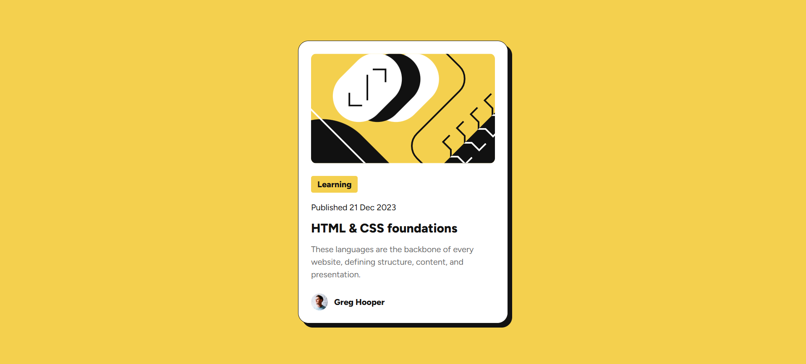

# Frontend Mentor - Blog preview card solution

This is a solution to the [Blog preview card challenge on Frontend Mentor](https://www.frontendmentor.io/challenges/blog-preview-card-ckPaj01IcS). Frontend Mentor challenges help you improve your coding skills by building realistic projects. 

### The challenge

Users should be able to:

- See hover and focus states for all interactive elements on the page

### Screenshots

### Links

- Solution URL: https://www.frontendmentor.io/solutions/blog-preview-card-using-flexbox-SJ21IrXP8o
- Live Site URL: https://mzdemir-blog-preview-card.netlify.app/

### Built with

- Semantic HTML5 markup
- Flexbox

## Author

- Website - https://github.com/mzdemir
- Frontend Mentor - https://www.frontendmentor.io/profile/mzdemir
