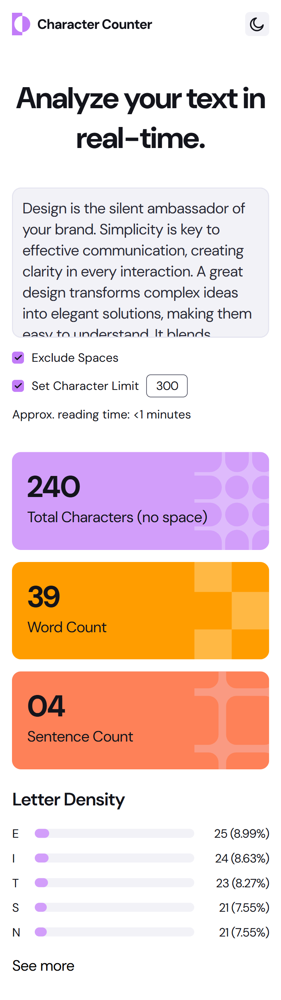
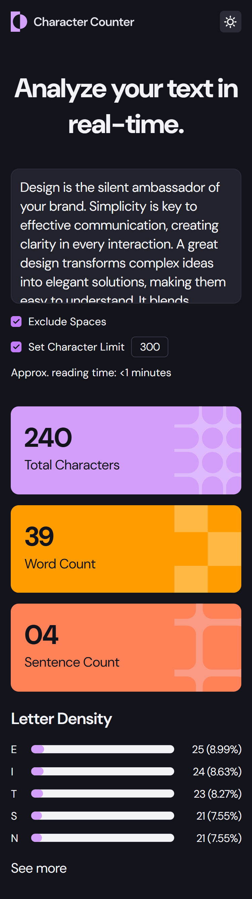
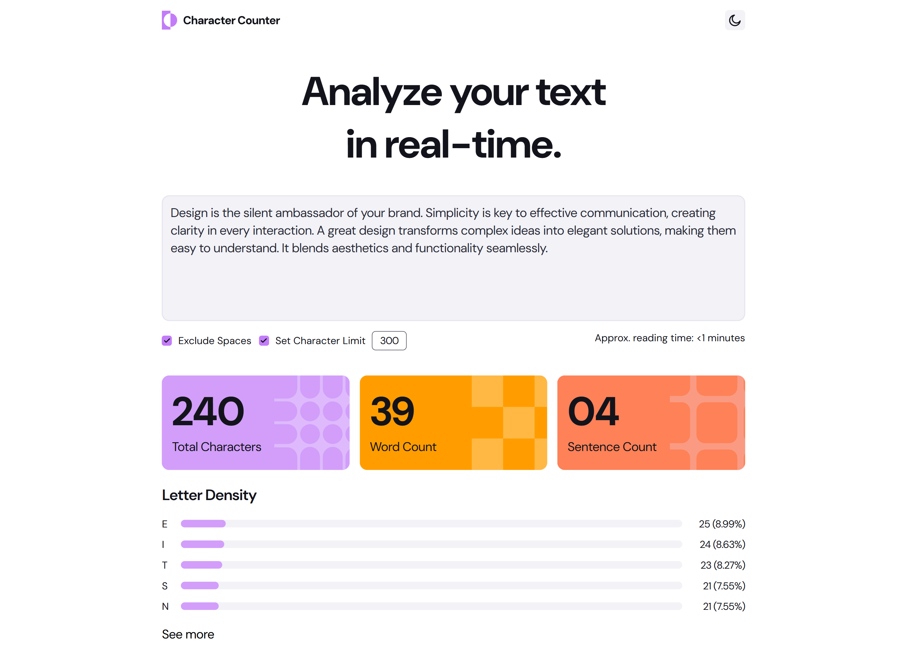
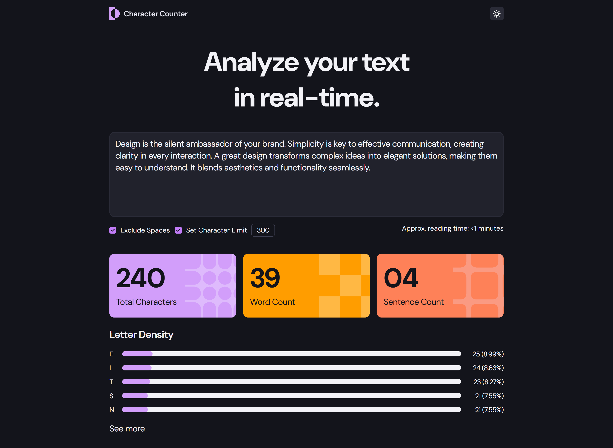
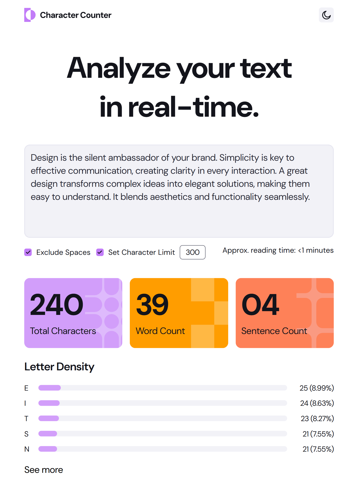
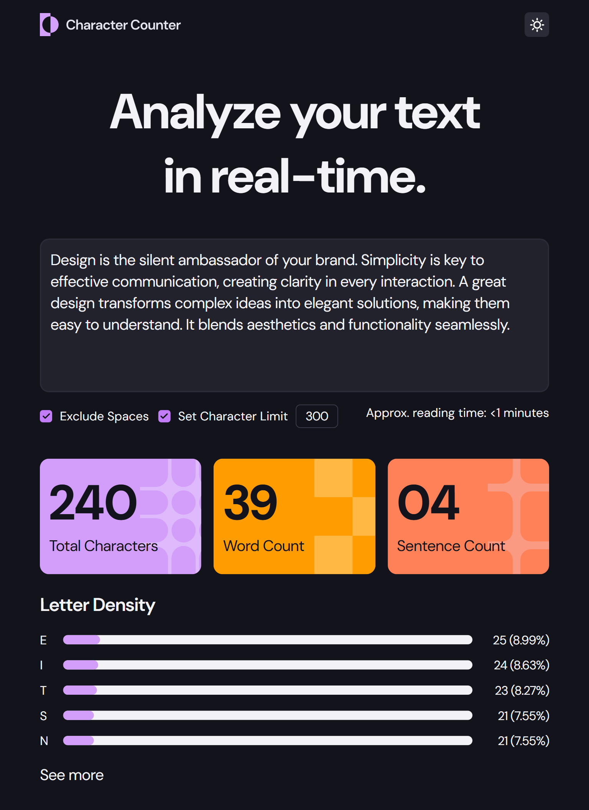
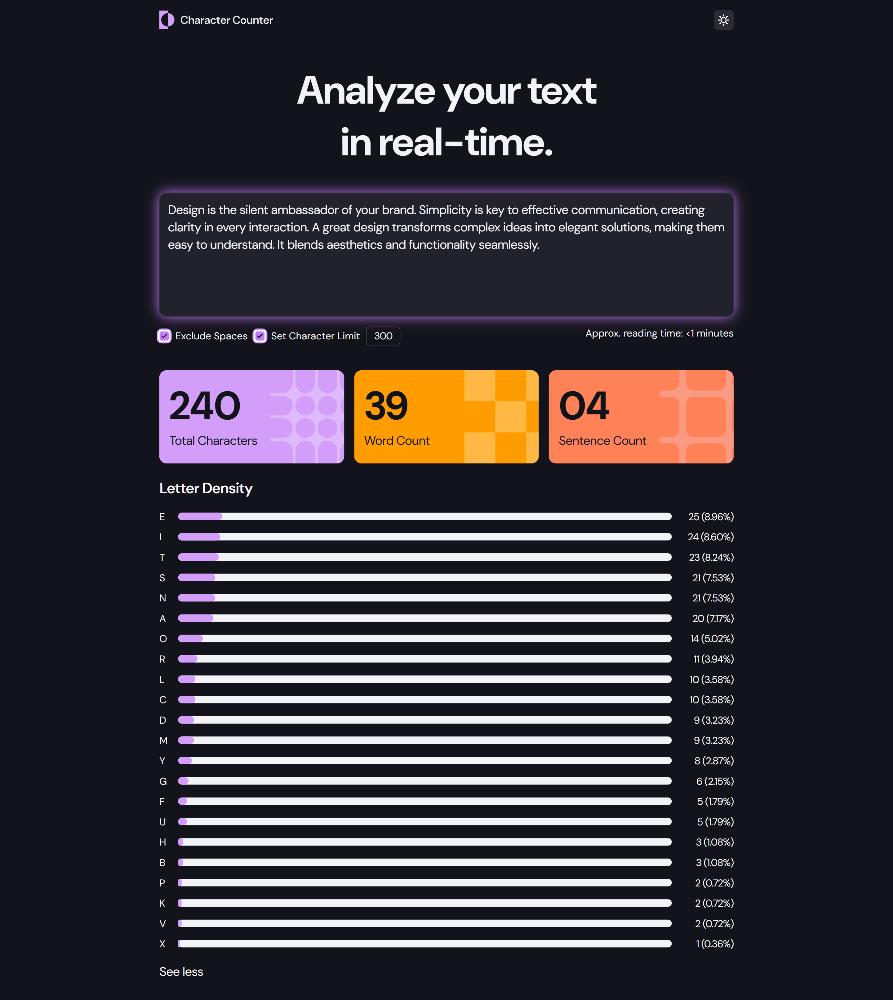
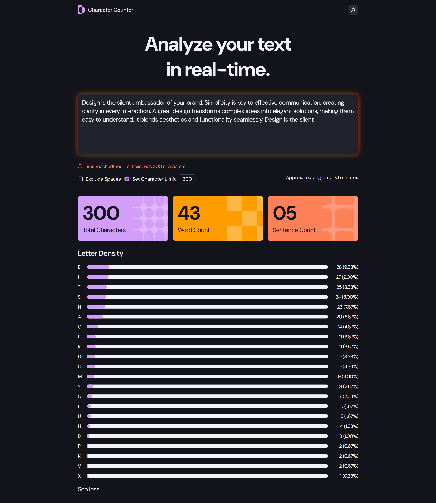

# Frontend Mentor - Character counter solution

This is a solution to the [Character counter challenge on Frontend Mentor](https://www.frontendmentor.io/challenges/character-counter-znSgeWs_i6). Frontend Mentor challenges help you improve your coding skills by building realistic projects.

### The challenge

Users should be able to:

- Analyze the character, word, and sentence counts for their text
- Exclude/Include spaces in their character count
- Set a character limit
- Receive a warning message if their text exceeds their character limit
- See the approximate reading time of their text
- Analyze the letter density of their text
- Select their color theme
- View the optimal layout for the interface depending on their device's screen size
- See hover and focus states for all interactive elements on the page

### Screenshot

<table>
  <tr>
    <td></td>
    <td></td>
  </tr>
  <tr>
    <td></td>
    <td></td>
  </tr>
  <tr>
    <td></td>
    <td></td>  
  </tr>
  <tr>
    <td></td>
    <td></td>
  </tr>
</table>

### Links

- Solution URL: [Add solution URL here](https://your-solution-url.com)
- Live Site URL: https://mzdemir-character-counter.netlify.app/

## My process

### Built with

- Semantic HTML5 markup
- Css/Sass
- Javascript
- Mobile-first workflow
- Accessibility

## Author

- Website - https://github.com/mzdemir
- Frontend Mentor - https://www.frontendmentor.io/profile/mzdemir
