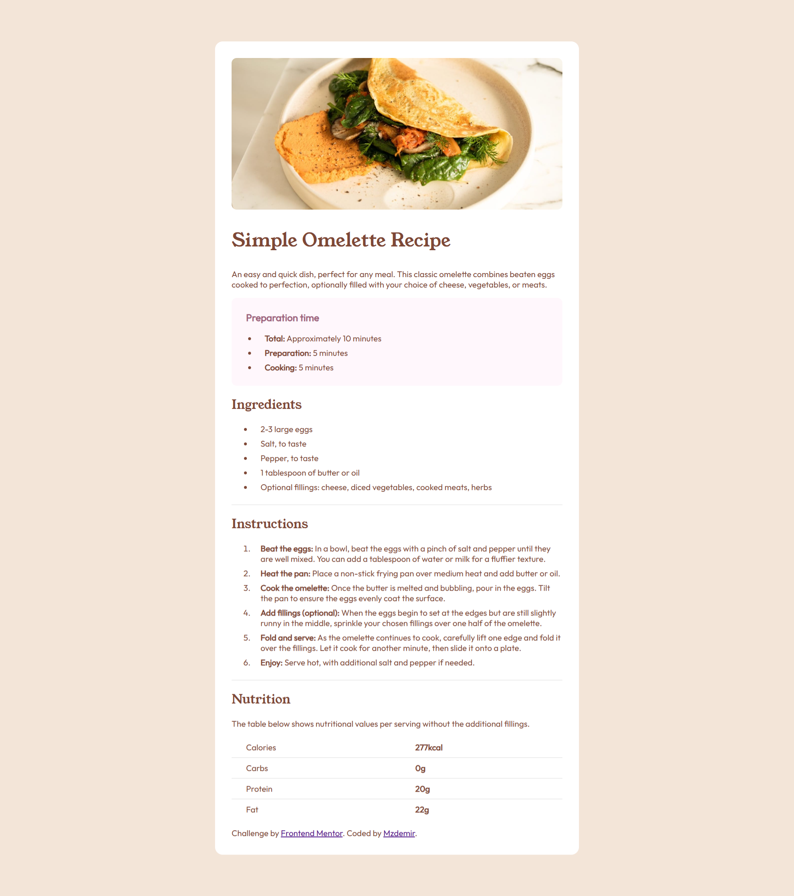
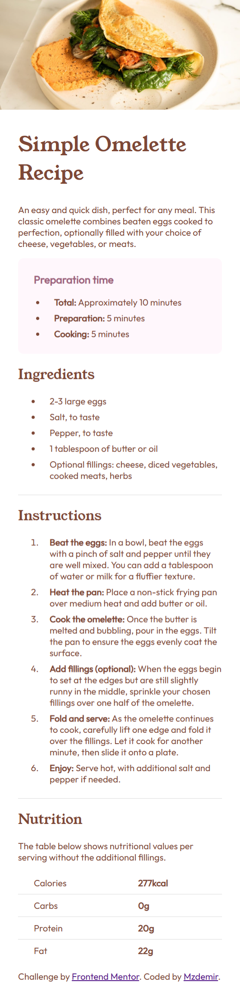

# Frontend Mentor - Recipe page solution

This is a solution to the [Recipe page challenge on Frontend Mentor](https://www.frontendmentor.io/challenges/recipe-page-KiTsR8QQKm). Frontend Mentor challenges help you improve your coding skills by building realistic projects. 

### Screenshots

<table>
  <tr>
    <td></td>
    <td></td>
  </tr>
</table>

### Links

- Solution URL:  https://www.frontendmentor.io/solutions/responsive-recipe-main-page-using-html-and-css-yldzDqHioJ
- Live Site URL: https://mzdemir-recipe-page-main.netlify.app/

## My process

### Built with

- Semantic HTML5 markup
- Vanilla CSS 
- Mobile-first workflow

## Author

- Website - https://github.com/mzdemir
- Frontend Mentor - https://www.frontendmentor.io/profile/mzdemir
